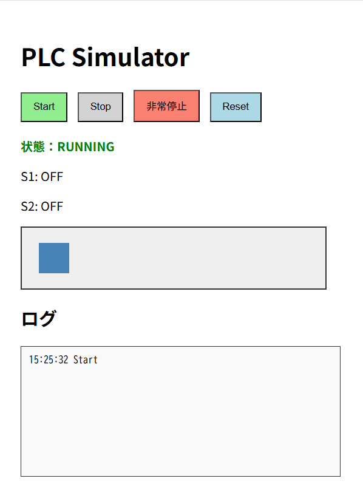
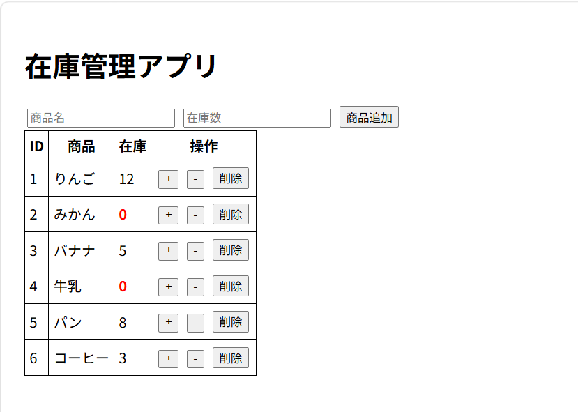
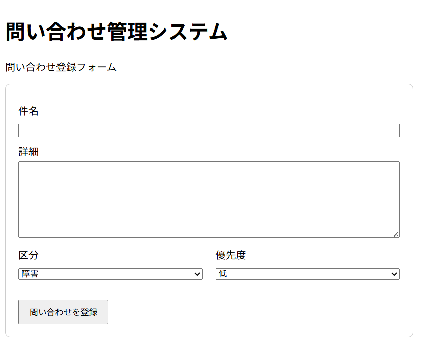

HTML/CSS/JavaScriptを用いた個人開発成果物です。

---

## 1. PLCコンベア制御シミュレータ

PLCの状態遷移を模したシミュレータです。開始、停止、異常時の非常停止を実装しています。

Repository:
https://github.com/Works-0786/plc-conveyor-simulator

---

## 2. 在庫管理アプリ

商品追加、在庫増減、削除、LocalStorage保存に対応した在庫管理アプリです。

Repository:
https://github.com/Works-0786/inventory-management-app

---

## 3. 問い合わせ管理システム

問い合わせの登録・一覧表示・状態変更・状態絞り込み表示・削除・LocalStorage保存に対応した問い合わせ管理システムです。

Repository:
https://github.com/Works-0786/inquiry-management-system
